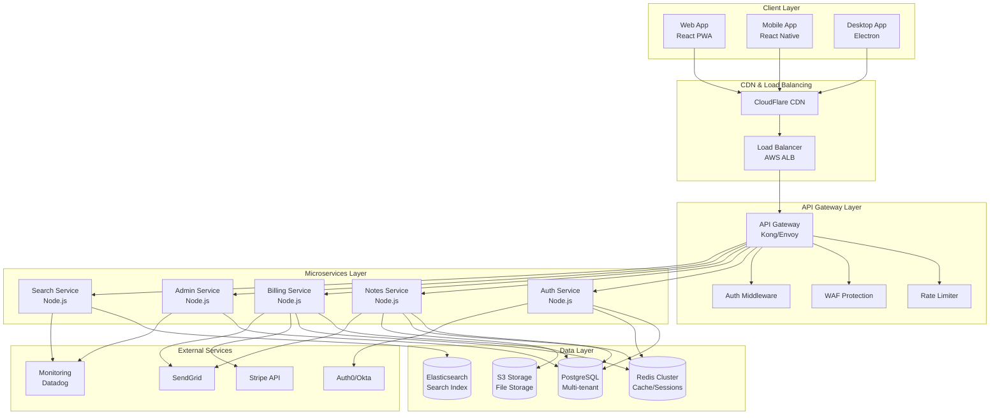
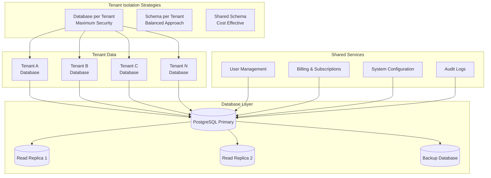
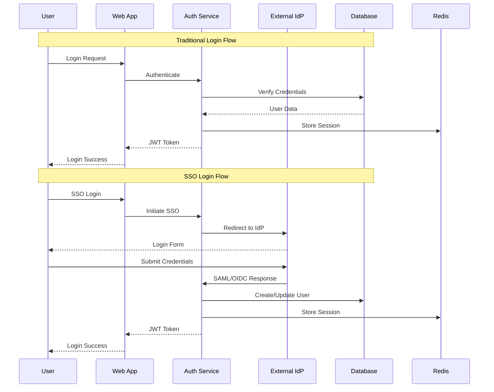
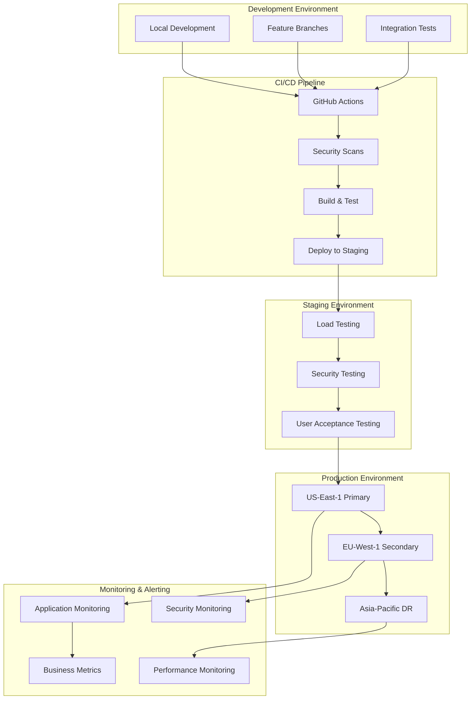
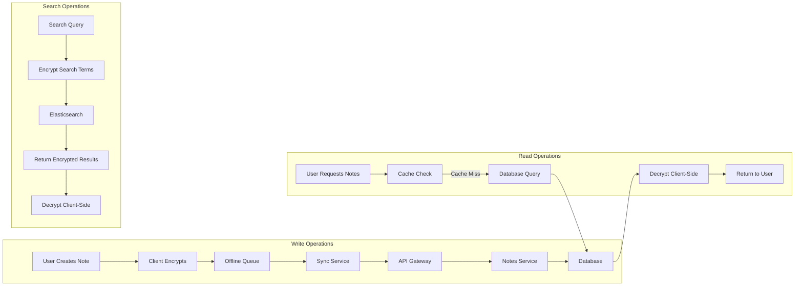

# Enterprise Secure Notes - Architecture Diagrams

## Overall System Architecture



## Multi-Tenant Database Architecture



## Security Architecture

```mermaid
graph LR
    subgraph "Client Security"
        A[Browser]
        B[Local Encryption<br/>AES-GCM]
        C[Key Derivation<br/>PBKDF2/Argon2]
        D[Offline Storage<br/>IndexedDB]
    end

    subgraph "Network Security"
        E[HTTPS/TLS 1.3]
        F[WAF Protection]
        G[API Gateway]
    end

    subgraph "Application Security"
        H[JWT with Rotation]
        I[Multi-Factor Auth]
        J[Session Management]
        K[RBAC Authorization]
    end

    subgraph "Data Security"
        L[Database Encryption<br/>at Rest]
        M[Encrypted Backups]
        N[Key Management<br/>HSM]
        O[Audit Logging]
    end

    A --> B
    B --> C
    C --> D
    D --> E
    E --> F
    F --> G
    G --> H
    H --> I
    I --> J
    J --> K
    K --> L
    L --> M
    M --> N
    N --> O
```



## Authentication Flow



## Deployment Architecture



## Data Flow Architecture



## Subscription & Billing Flow

```mermaid
graph TB
    subgraph "Subscription Management"
        A[User Selects Plan]
        B[Stripe Checkout]
        C[Payment Processing]
        D[Webhook Handler]
        E[Update User Plan]
        F[Apply Plan Limits]
    end

    subgraph "Usage Tracking"
        G[API Request Counter]
        H[Storage Usage Monitor]
        I[Feature Usage Analytics]
        J[Billing Calculation]
    end

    subgraph "Plan Enforcement"
        K[Rate Limiting]
        L[Storage Quotas]
        M[Feature Access Control]
        N[Upgrade Prompts]
    end

    A --> B
    B --> C
    C --> D
    D --> E
    E --> F

    G --> J
    H --> J
    I --> J
    J --> K
    J --> L
    J --> M
    J --> N