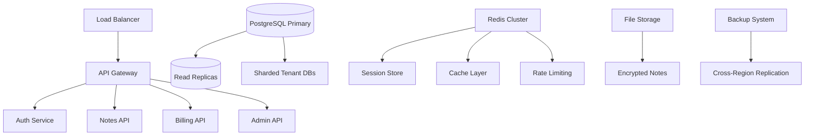

# Enterprise Secure Notes SaaS - Improvement Plan

## Executive Summary

Transform the existing secure notes application into a production-ready, enterprise-level SaaS platform with advanced security, multi-tenancy, compliance features, and professional user experience.

## Current State Analysis

### Strengths
- ✅ Strong foundation with client-side AES-GCM encryption
- ✅ JWT-based authentication
- ✅ Offline support with sync capabilities
- ✅ Modern tech stack (React 19, Node.js, TypeScript)
- ✅ Good separation of concerns (MVI pattern)
- ✅ IndexedDB for offline storage

### Critical Gaps for Enterprise SaaS
- ❌ No multi-tenancy support
- ❌ No billing/subscription management
- ❌ No enterprise authentication (SSO, 2FA)
- ❌ No compliance/audit features
- ❌ No admin dashboard
- ❌ Limited scalability
- ❌ No monitoring/observability
- ❌ No API rate limiting/throttling
- ❌ No data backup/recovery
- ❌ No enterprise security features

## 1. Enterprise Security Architecture

### 1.1 Enhanced Authentication & Authorization
**Current**: Basic JWT authentication
**Target**: Enterprise-grade security

#### Multi-Factor Authentication (MFA)
- TOTP (Time-based One-Time Passwords) via authenticator apps
- SMS-based verification
- Email-based backup codes
- Hardware security key support (FIDO2/WebAuthn)

#### Single Sign-On (SSO) Integration
- SAML 2.0 integration for enterprise identity providers
- OAuth 2.0 / OpenID Connect
- Support for Azure AD, Okta, Auth0, OneLogin
- Just-in-time (JIT) user provisioning

#### Advanced Session Management
- Device fingerprinting and management
- Concurrent session limits per user/plan
- Automatic session timeout with activity detection
- Geographic access controls and anomaly detection
- Session revocation and force logout capabilities

### 1.2 Enhanced Encryption & Key Management
**Current**: Password-derived keys using PBKDF2
**Target**: Enterprise key management

#### Client-Side Key Enhancement
- Hardware security module (HSM) integration where available
- Multiple key derivation methods (Argon2id, scrypt)
- Key rotation policies and automatic re-encryption
- Split knowledge for recovery keys

#### Zero-Knowledge Architecture
- End-to-end encryption with zero-knowledge of user passwords
- Encrypted user metadata (timestamps, tags, etc.)
- Client-side key backup and recovery mechanisms

### 1.3 Security Compliance & Auditing
- SOC 2 Type II compliance preparation
- GDPR compliance features
- HIPAA-ready architecture (for healthcare)
- Comprehensive audit logging
- Real-time security monitoring
- Automated vulnerability scanning
- Penetration testing framework

## 2. Multi-Tenant SaaS Architecture

### 2.1 Database & Infrastructure Design

#### Multi-Tenancy Models
1. **Database per Tenant**: Maximum isolation for enterprise clients
2. **Schema per Tenant**: Good balance of isolation and efficiency
3. **Shared Schema**: Cost-effective for individual users

### 2.2 Tenant Management
- Tenant onboarding and provisioning
- Custom domain support
- Tenant-specific configurations
- Data isolation and access controls
- Tenant usage monitoring and quotas

## 3. Enterprise Features

### 3.1 Advanced Note Management
#### Organization & Discovery
- Hierarchical folder structure
- Tag-based organization with auto-suggestions
- Full-text search with encrypted indexing
- Advanced filters (date, tags, content type)
- Note templates and snippets
- Version history with diff viewing

#### Collaboration Features
- Shared notes and folders with granular permissions
- Real-time collaborative editing
- Comment and annotation system
- Activity feeds and change notifications
- Team workspaces and permissions

#### Export & Integration
- Multiple export formats (PDF, Markdown, Plain Text)
- API for third-party integrations
- Webhook system for external notifications
- Calendar integration for scheduled notes

### 3.2 User Management & Administration
#### Admin Dashboard
- User management interface
- Tenant configuration panel
- Usage analytics and reporting
- Security monitoring dashboard
- System health monitoring

#### Enterprise Controls
- User provisioning and de-provisioning
- Role-based access control (RBAC)
- Policy enforcement (password policies, session limits)
- Data retention policies
- Compliance reporting

## 4. Billing & Subscription Management

### 4.1 Subscription Tiers
#### Individual Tier
- Up to 1000 notes
- Basic encryption
- Email support
- 5GB storage

#### Professional Tier
- Unlimited notes
- Advanced search
- Collaboration features
- Priority support
- 50GB storage

#### Enterprise Tier
- Unlimited everything
- SSO integration
- Custom compliance
- Dedicated support
- Unlimited storage
- Custom integrations

### 4.2 Billing Infrastructure
- Stripe integration for payments
- Usage-based billing for storage and API calls
- Proration and upgrade/downgrade handling
- Invoice generation and management
- Tax calculation and compliance
- Payment method management

## 5. Performance & Scalability

### 5.1 Frontend Optimizations
- Progressive Web App (PWA) with offline-first architecture
- Code splitting and lazy loading
- Service Worker enhancements
- IndexedDB optimizations
- Background sync improvements

### 5.2 Backend Scaling
- Microservices architecture
- Database sharding and read replicas
- Redis clustering for caching and sessions
- CDN integration for static assets
- API rate limiting and throttling
- Background job processing (Bull/Redis)

### 5.3 Infrastructure
- Container orchestration (Kubernetes/Docker Swarm)
- Auto-scaling based on demand
- Multi-region deployment
- Database backup and disaster recovery
- Monitoring and alerting (Prometheus, Grafana)

## 6. Quality Assurance & Testing

### 6.1 Comprehensive Testing Strategy
- Unit testing (90%+ coverage)
- Integration testing
- End-to-end testing with Playwright
- Security testing (OWASP ZAP)
- Performance testing (k6/JMeter)
- Accessibility testing (axe-core)

### 6.2 Security Testing
- Automated vulnerability scanning
- Dependency security monitoring
- Regular penetration testing
- Security code reviews
- Threat modeling exercises

## 7. Monitoring & Observability

### 7.1 Application Monitoring
- Application performance monitoring (APM)
- Error tracking and alerting
- User behavior analytics
- Security event monitoring
- Compliance audit trails

### 7.2 Infrastructure Monitoring
- System resource monitoring
- Database performance monitoring
- Network latency and availability
- Backup success monitoring
- Cost optimization tracking

## 8. Implementation Roadmap

### Phase 1: Foundation (Months 1-3)
- [ ] Multi-tenant database architecture
- [ ] Enhanced authentication (MFA, session management)
- [ ] Basic billing integration
- [ ] Admin dashboard MVP
- [ ] Security audit logging

### Phase 2: Enterprise Features (Months 4-6)
- [ ] SSO integration
- [ ] Advanced note management
- [ ] Collaboration features
- [ ] Compliance features
- [ ] Performance optimizations

### Phase 3: Scale & Optimize (Months 7-9)
- [ ] Microservices migration
- [ ] Advanced monitoring
- [ ] Multi-region deployment
- [ ] Enterprise integrations
- [ ] Security certifications

### Phase 4: Launch Preparation (Months 10-12)
- [ ] Load testing and optimization
- [ ] Security audits and certifications
- [ ] Documentation and training materials
- [ ] Customer support systems
- [ ] Go-to-market preparation

## 9. Technology Stack Enhancements

### Backend Improvements
- **Authentication**: Passport.js, Auth0 SDK, custom MFA
- **Billing**: Stripe Connect, subscription management
- **Monitoring**: Winston, Prometheus, Grafana
- **Caching**: Redis Cluster with sentinel
- **Queue System**: Bull/Bee-Queue for background jobs
- **File Storage**: AWS S3 with encryption
- **Search**: Elasticsearch for encrypted search

### Frontend Enhancements
- **State Management**: Redux Toolkit with RTK Query
- **UI Framework**: Material-UI or Chakra UI for enterprise feel
- **Testing**: Playwright, Testing Library, Jest
- **Build**: Webpack optimization, bundle analysis
- **PWA**: Workbox for advanced service worker features

### Infrastructure
- **Containerization**: Docker with multi-stage builds
- **Orchestration**: Kubernetes with Helm charts
- **CI/CD**: GitHub Actions with security scanning
- **Monitoring**: ELK stack, Prometheus, Grafana
- **Security**: WAF, DDoS protection, vulnerability scanning

## 10. Success Metrics

### Technical Metrics
- 99.9% uptime SLA
- <200ms API response time
- 100% test coverage for critical paths
- Zero critical security vulnerabilities
- <5 second page load times

### Business Metrics
- User acquisition and retention rates
- Monthly recurring revenue (MRR)
- Customer support ticket volume
- Feature adoption rates
- Security incident frequency

## 11. Risk Mitigation

### Security Risks
- Regular security audits and penetration testing
- Automated vulnerability scanning
- Incident response plan
- Data encryption at rest and in transit
- Backup and disaster recovery procedures

### Technical Risks
- Gradual migration to microservices
- Comprehensive testing at each phase
- Rollback procedures for all deployments
- Performance monitoring and alerting
- Capacity planning and auto-scaling

### Business Risks
- Legal review for compliance requirements
- Privacy policy and terms of service
- Customer data protection measures
- Support and maintenance planning
- Competitive analysis and differentiation

## Conclusion

This comprehensive plan transforms the secure notes application into a production-ready, enterprise-level SaaS platform. The phased approach ensures steady progress while maintaining security and quality standards throughout development.

The key to success will be maintaining the strong security foundation while adding enterprise features, ensuring scalability, and providing exceptional user experience for both individual users and enterprise customers.